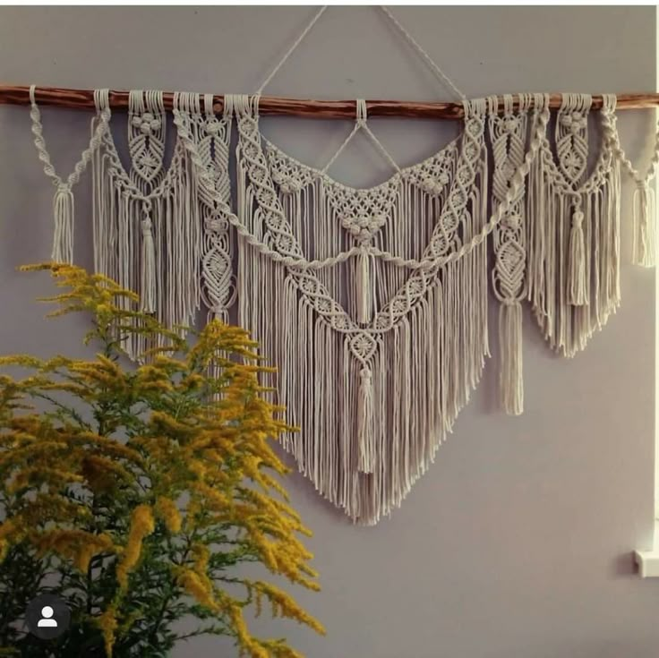

# Pastel Düğümleri

Pastel Düğümleri, el yapımı makrome ve pastel tonlu dekor ürünlerini vitrine çıkaran modern bir React SPA'sıdır. Ürün kataloğu, sepet deneyimi ve üretici başvuru içerikleriyle küçük butik markalar için hazır bir satış sayfası sunar.

## İçindekiler
- [Öne Çıkanlar](#öne-çıkanlar)
- [Ekran Görüntüsü](#ekran-görüntüsü)
- [Teknolojiler](#teknolojiler)
- [Kurulum](#kurulum)
- [NPM Komutları](#npm-komutları)
- [Proje Yapısı](#proje-yapısı)
- [Özelleştirme İpuçları](#özelleştirme-ipuçları)
- [Lisans](#lisans)

## Öne Çıkanlar
- 🔍 Türkçe karakter desteğiyle çalışan akıllı ürün arama
- 🛒 Adet yönetimi, sepetten çıkarma ve sepet özetini gösteren gelişmiş sepet deneyimi
- ✨ Pastel tonlarda tasarlanmış, mobil uyumlu ve sade arayüz
- 🤝 El işi üreticilerini teşvik eden hikâye kartları ve başvuru CTA alanları
- ⚡ Tek dependency React ekosistemi; hızlı kurulum, hızlı dağıtım

## Ekran Görüntüsü


## Teknolojiler
- React 18 + React Router DOM 6
- React Scripts 5 (CRA tabanlı yapılandırma)
- Vanilla CSS ile responsive tasarım ve pastel renk paleti

## Kurulum
```bash
# Depoyu kopyalayın
git clone git@github.com:yusuf3641/Pastel_Dugumleri.git
cd Pastel_Dugumleri

# Bağımlılıkları yükleyin
npm install

# Geliştirme sunucusunu başlatın
npm start
```
> Uygulama varsayılan olarak `http://localhost:3000` adresinde çalışır.

## NPM Komutları
- `npm start` : Hot reload destekli geliştirme sunucusu
- `npm run build` : Prod için optimize edilmiş statik çıktı (`build/`)

## Proje Yapısı
```text
Pastel_Düğümleri/
├─ public/
│  ├─ images/                  # Ürün & hikâye görselleri
│  ├─ index.html               # CRA giriş noktası
│  └─ logo.svg
├─ src/
│  ├─ App.js                   # Router, navbar ve sepet yönetimi
│  ├─ App.css                  # Global pastel tema stilleri
│  ├─ Cart.js                  # Sepet sayfası ve adet kontrolleri
│  ├─ Contact.js               # İletişim formu
│  ├─ Home.js                  # Hero, üretici hikâyeleri
│  └─ Products.js              # Arama filtresi + ürün kartları
├─ assets/
│  └─ readme-cover.jpg         # README için tanıtım görseli
├─ package.json
├─ package-lock.json
├─ README.md
└─ LICENSE
```

## Özelleştirme İpuçları
- Yeni ürünler eklemek için `src/Products.js` içindeki `products` dizisine yeni objeler ekleyin.
- Tema renklerini ve tipografiyi `src/App.css` üzerinden hızlıca güncelleyebilirsiniz.
- Üretici hikâyelerini `Home.js` içindeki kartlarda düzenleyebilir, yeni ifadeler ekleyebilirsiniz.
- `public/images/` klasörüne yeni görseller ekleyerek mevcut ürün kartlarını zenginleştirin.

## Lisans
Bu proje MIT Lisansı ile sunulmaktadır. Ayrıntılar için [LICENSE](LICENSE) dosyasını inceleyebilirsiniz.
