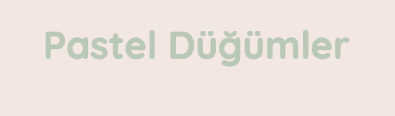

# Pastel Düğümleri

Pastel Düğümleri, modern ve pastel tonlarda tasarlanmış minimal bir emlak ilanı landing page'idir. Küçük ölçekli emlak portföyleri, freelance danışmanlar veya konsept projeler için hızlıca vitrini ortaya çıkarmak isteyenlere hazır bir başlangıç sunar.

## İçindekiler
- [Özellikler](#özellikler)
- [Ekran Görüntüsü](#ekran-görüntüsü)
- [Teknolojiler](#teknolojiler)
- [Hızlı Başlangıç](#hızlı-başlangıç)
- [Proje Yapısı](#proje-yapısı)
- [Geliştirme İpuçları](#geliştirme-ipuçları)
- [Lisans](#lisans)

## Özellikler
- Dinamik olarak oluşturulan ilan kartları ile kolay içerik yönetimi
- Pastel renk paleti ve responsive (mobil uyumlu) bir grid yerleşimi
- İletişim formu üzerinden tek adımda geri bildirim toplama
- Vanilla JS ve CSS ile minimum bağımlılık, maksimum hız

## Ekran Görüntüsü


## Teknolojiler
- HTML5 ile semantik temel
- Vanilla CSS ile responsive grid ve tipografi
- JavaScript (ES6) ile ilan yönetimi ve form etkileşimi

## Hızlı Başlangıç
1. Depoyu klonlayın:
   ```bash
   git clone git@github.com:yusuf3641/Pastel_Dugumleri.git
   ```
2. Proje dizinine girin:
   ```bash
   cd Pastel_Dugumleri
   ```
3. `index.html` dosyasını tarayıcınızda açın ya da bir canlı sunucu eklentisi kullanın.

## Proje Yapısı
```text
Pastel_Düğümleri/
├─ assets/
│  └─ pastel-dugumleri-preview.png   # README’de kullanılan ekran görüntüsü
├─ index.html                        # Projenin ana sayfa şablonu
├─ style.css                         # Pastel tema ve responsive düzen
├─ script.js                         # İlan kartlarını oluşturan ve formu yöneten JS
└─ README.md                         # Proje dokümantasyonu
```

## Geliştirme İpuçları
- Yeni ilan kartları eklemek için `script.js` içindeki `listings` dizisine yeni nesneler ekleyin.
- Tema renklerini güncellemek isterseniz `style.css` içerisindeki renk değerlerini düzenleyin.
- Form verilerini bir backend’e göndermek için submit event’i içinde `fetch` ya da `axios` gibi çözümlerle entegrasyon ekleyebilirsiniz.

## Lisans
Bu proje MIT Lisansı ile lisanslanmıştır. Ayrıntılar için [LICENSE](LICENSE) dosyasına göz atın.
