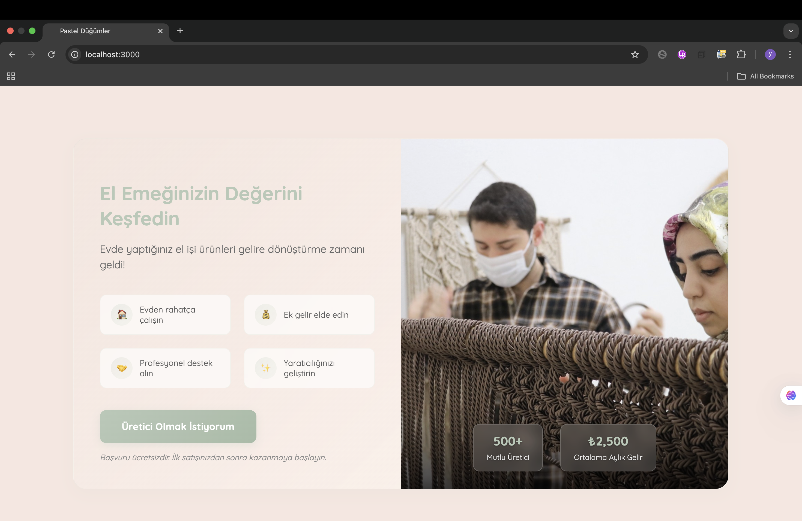
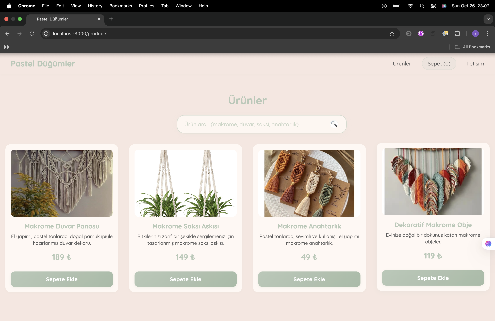

# Pastel Düğümleri

Pastel Düğümleri, makrome üreticilerini pastel tonlarda bir vitrinle bir araya getiren butik bir satış uygulamasıdır. Hem üreticilerin el emeği ürünlerini doğrudan satabildiği hem de markamız üzerinden satış ortaklığı kurabildiği bir pazar yeri deneyimi sunar.

## İçindekiler
- [Projenin Amacı](#projenin-amacı)
- [Arayüz Önizlemeleri](#arayüz-önizlemeleri)
- [Teknolojiler](#teknolojiler)
- [Kurulum Adımları](#kurulum-adımları)
- [NPM Komutları](#npm-komutları)
- [Proje Yapısı](#proje-yapısı)
- [Özelleştirme İpuçları](#özelleştirme-ipuçları)
- [Lisans](#lisans)

## Projenin Amacı
- El yapımı makrome ürünleri üreten kadın girişimcilerin ürünlerini dijital vitrine taşımak.
- Üreticilerin stok ve siparişlerini yönetmesini kolaylaştıracak temel sepet fonksiyonlarını sağlamak.
- Markamızın üreticilerle iş birliği kurmasını mümkün kılan iletişim ve başvuru adımlarını merkezileştirmek.
- Pastel tonlarda, güven veren ve hikâye anlatımını öne çıkaran kullanıcı arayüzüyle butik bir marka deneyimi yaşatmak.

## Arayüz Önizlemeleri
| Üretici Hikâyesi & CTA | Ürün Kataloğu |
| --- | --- |
|  |  |

## Teknolojiler
- React 18 + React Router DOM 6
- React Scripts 5 (CRA tabanlı yapılandırma)
- Vanilla CSS ile responsive pastel tema

## Kurulum Adımları
1. **Gereksinimler**
   - Node.js 16 veya üzeri (kontrol için `node -v`)
   - npm 8 veya üzeri (kontrol için `npm -v`)
2. **Depoyu klonlayın**
   ```bash
   git clone git@github.com:yusuf3641/Pastel_Dugumleri.git
   cd Pastel_Dugumleri
   ```
3. **Bağımlılıkları yükleyin**
   ```bash
   npm install
   ```
4. **Geliştirme sunucusunu başlatın**
   ```bash
   npm start
   ```
   - Varsayılan olarak tarayıcınız `http://localhost:3000` adresine yönlendirilir.
   - Otomatik açılmazsa URL'yi manuel ziyaret edebilirsiniz.
5. **Prod yapısı almak isterseniz**
   ```bash
   npm run build
   ```
   - Statik dosyalar `build/` klasörüne oluşturulur ve herhangi bir statik sunucuda yayınlanabilir.

## NPM Komutları
- `npm start` – Hot reload destekli geliştirme sunucusu
- `npm run build` – Üretim için optimize edilmiş paket

## Proje Yapısı
```text
Pastel_Düğümleri/
├─ public/
│  ├─ images/                  # Ürün ve üretici hikâyesi görselleri
│  ├─ index.html               # CRA giriş noktası
│  └─ logo.svg
├─ src/
│  ├─ App.js                   # Router, navbar ve sepet yönetimi
│  ├─ App.css                  # Global pastel tema stilleri
│  ├─ Cart.js                  # Sepet sayfası ve adet kontrolleri
│  ├─ Contact.js               # İletişim formu ve CTA
│  ├─ Home.js                  # Üretici hikâyeleri ve başvuru alanı
│  └─ Products.js              # Arama, filtreleme ve ürün kartları
├─ assets/
│  ├─ pastel-dugumleri-hero.png  # README’de kullanılan üretici hikâyesi ekranı
│  └─ pastel-dugumleri-ui.png    # README’de kullanılan ürün kataloğu ekranı
├─ package.json
├─ package-lock.json
├─ README.md
└─ LICENSE
```

## Özelleştirme İpuçları
- Yeni ürünler eklemek için `src/Products.js` içindeki `products` dizisini güncelleyin.
- Tema renkleri ve tipografiyi `src/App.css` içerisinde hızlıca değiştirebilirsiniz.
- Üretici hikâyelerini `Home.js` üzerinde düzenleyerek marka tonunu kişiselleştirin.
- `public/images/` klasörüne yeni görseller ekleyerek ürün kataloğunu genişletin.

## Lisans
Bu proje MIT Lisansı ile sunulmaktadır. Ayrıntılar için [LICENSE](LICENSE) dosyasını inceleyebilirsiniz.
